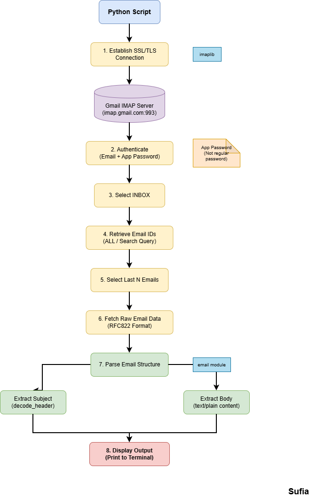

# Read Mail Body & Subject

## System Workflow / Architecture
An Overview

## Problem Statement

Security analysts and automation systems sometimes need to **programmatically access email content** to analyze alerts, notifications, or suspicious messages.  
Manually opening emails can be inefficient for automated workflows.

This tool demonstrates how to **connect to a Gmail inbox using IMAP and extract the subject and body of the most recent emails using Python.**

## Approach / Methodology

### Technologies Used
- Python 3.x
- `imaplib` for IMAP email access
- `email` module for parsing email messages
- `email.header` for decoding encoded subjects
- Secure login using **App Password**

### Workflow / Pipeline

1. Establish a secure connection to the Gmail IMAP server.
2. Authenticate using the email account and App Password.
3. Select the **INBOX** mailbox.
4. Retrieve a list of all email IDs.
5. Select the **last N emails** (most recent).
6. Fetch each email’s raw data.
7. Parse the email structure to extract:
   - Subject
   - Plain-text message body
8. Print the extracted information in the terminal.

## Output / Results

%20read%20-%20subject%20and%20body.png)
 
## Real-World Application

- Automated **email monitoring for SOC alerts**
- Parsing notification emails from monitoring systems
- Collecting data for **phishing analysis**
- Building automated pipelines for **security alert ingestion**
- Integrating email alerts into security dashboards or bots

 

## Advantages

- Automates reading email content programmatically
- Demonstrates secure email access via **IMAP over SSL**
- Can be extended for:
  - phishing detection
  - spam classification
  - automated alert pipelines
- Useful building block for **SOC automation workflows**
