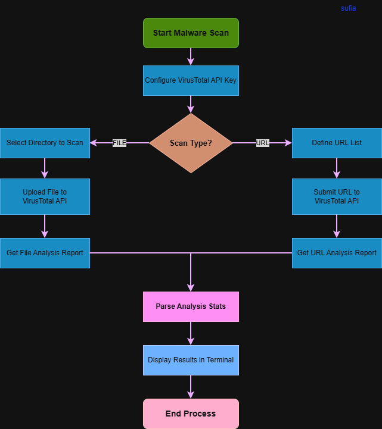

# Malware Check using VirusTotal API

## System Workflow / Architecture

## Problem Statement

Malicious files and unsafe URLs are one of the primary causes of cyber attacks in modern systems.

Organizations and cybersecurity analysts need a reliable way to:

- scan files for malware
- detect malicious URLs
- identify suspicious activity
- automate malware checking

Manual malware scanning using antivirus tools is slow and not scalable.

This tool automates malware detection by integrating with **VirusTotal API**, allowing users to scan files and URLs directly from a Python script.

 

## Approach / Methodology

### Technologies Used

- Python 3
- VirusTotal API
- Requests library
- OS module
- Time module
- REST API integration

### Workflow

1. Select a directory to scan files.
2. Define URLs to scan.
3. Upload files to VirusTotal API.
4. Upload URLs to VirusTotal API.
5. Retrieve analysis report.
6. Extract results:
   - Malicious
   - Suspicious
   - Harmless
   - Undetected
7. Display results in terminal.
8. Maintain API rate limit.
 

## Output / Results

 

This tool can be used in:

- Security Operations Centers (SOC)
- Malware Analysis Labs
- Incident Response Teams
- Endpoint Security Monitoring
- Threat Intelligence Systems

Used in real environments for:

- suspicious file scanning
- phishing URL detection
- malware analysis
- automated threat monitoring

This demonstrates how real cybersecurity tools integrate with threat intelligence platforms.

 

## Advantages

- Automated malware detection
- Integration with VirusTotal threat intelligence
- Supports both file and URL scanning
- Lightweight and easy to run
- API-based automation
- Useful for SOC and cybersecurity learners
- Scalable for enterprise environments
 

## Security Benefits

- Detects malicious files
- Identifies unsafe URLs
- Provides threat intelligence
- Supports incident investigation
- Reduces manual malware checking
- Improves security monitoring
 
