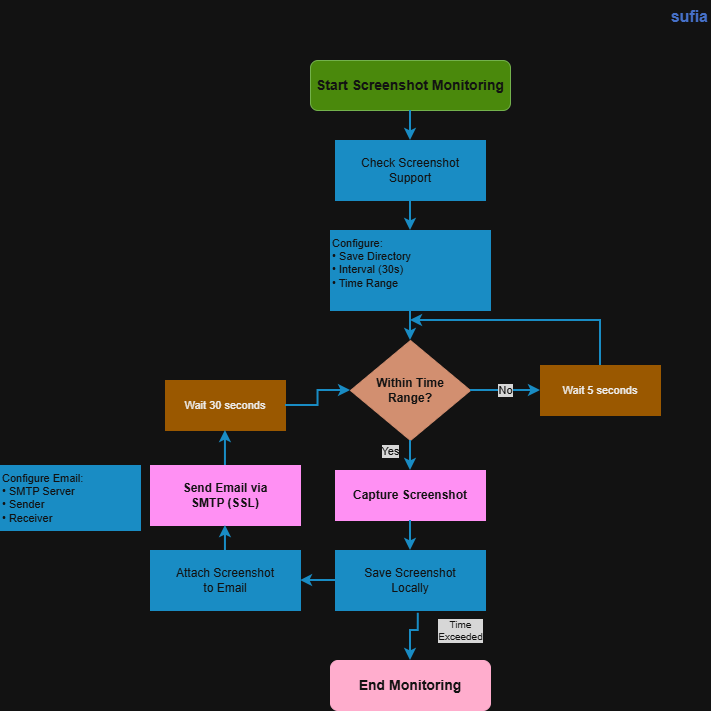

# Automated Screenshot Capture and Email Sender

## System Workflow / Architecture

## Problem Statement

Monitoring system activity is important in cybersecurity, especially in environments where:

- suspicious user activity needs to be tracked
- system behavior needs to be monitored
- remote monitoring is required
- evidence collection is needed for investigation

Manual monitoring is inefficient and unreliable.

This tool automates:

- screenshot capture
- periodic monitoring
- email delivery of screenshots
- scheduled monitoring within a time range

This helps in remote monitoring and activity tracking.
 

## Approach / Methodology

### Technologies Used

- Python 3
- pyautogui
- smtplib
- ssl
- email.message
- mimetypes
- datetime
- os
- time

### Workflow

1. Check if screenshot is supported on the system.
2. Define screenshot directory.
3. Set time interval (30 seconds).
4. Define start and end monitoring time.
5. Capture screenshot.
6. Save screenshot locally.
7. Attach screenshot to email.
8. Send email using SMTP.
9. Repeat until end time.

 

## Output / Results

 

## Real-World Application

This tool can be used in:

- Security monitoring systems
- Insider threat detection
- Remote workstation monitoring
- SOC investigation support
- Activity logging environments
- Compliance monitoring

Used for:

- capturing user activity
- collecting forensic evidence
- monitoring remote systems
- tracking suspicious behavior
- automated reporting

This demonstrates practical **host monitoring and automation**.

 

## Advantages

- Automated screenshot capture
- Scheduled monitoring
- Email delivery of screenshots
- Lightweight and simple
- Works on Linux and Windows
- Easy configuration
- Useful for cybersecurity learners
- Can be integrated into monitoring systems

 

## Security Benefits

- Tracks system activity
- Helps detect suspicious behavior
- Supports incident investigation
- Provides visual evidence
- Enables remote monitoring
- Improves endpoint visibility
