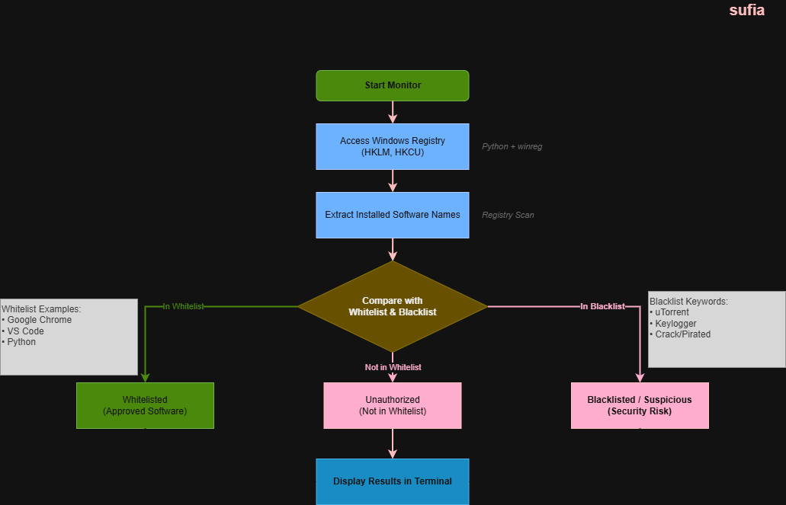

# Blacklist and Whitelist Software Monitor

## System Workflow / Architecture

## Problem Statement

In organizational environments, unauthorized or malicious software installations can introduce serious security risks.  
Security teams and system administrators need a way to **monitor installed applications and detect suspicious or unapproved software**.

Manually checking installed software through the Windows Control Panel or registry is inefficient and time-consuming.  
This tool automates the process by scanning installed software and comparing it against predefined **whitelist and blacklist policies**.

 

## Approach / Methodology

### Technologies Used

- Python 3.x
- Windows Registry (winreg)
- System monitoring logic
- Host-based security automation

### Workflow / Pipeline

1. Access Windows Registry paths containing installed software.
2. Extract all installed software names.
3. Compare software with predefined whitelist.
4. Compare software with blacklist keywords.
5. Classify software into three categories:
   - Installed Software
   - Unauthorized Software (not in whitelist)
   - Blacklisted/Suspicious Software
6. Display results in the terminal.

## Output / Results

Example output:

 

## Real-World Application

- Monitor unauthorized software in enterprise environments  
- Detect pirated or suspicious applications  
- Support SOC and system administrators in host monitoring  
- Enforce software installation policies  
- Improve endpoint security and compliance  

This tool can be integrated into:

- SIEM systems
- Endpoint monitoring tools
- Security automation pipelines
- Compliance monitoring systems

 

## Advantages

- Automates installed software monitoring
- Uses Windows Registry for accurate detection
- Detects both unauthorized and suspicious applications
- Lightweight and easy to deploy
- Can be extended with:
  - Email or Telegram alerts
  - CVE vulnerability scanning
  - Real-time monitoring
- Useful for host-based security and SOC automation
