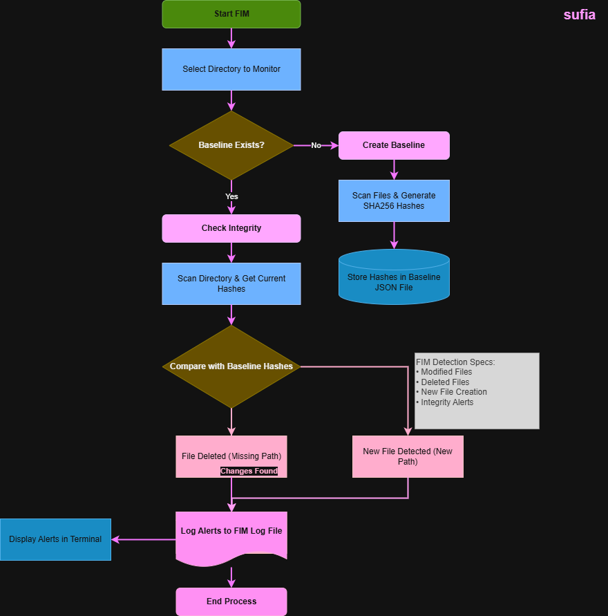

# File Integrity Monitor (FIM)

## System Workflow / Architecture

## Problem Statement

Unauthorized file changes are a common indicator of cyber attacks such as:

- Malware infection
- Ransomware
- Insider threats
- Unauthorized system modifications
- Data tampering

Security teams need a reliable way to monitor critical files and detect any changes.

This **File Integrity Monitor (FIM)** helps detect:

- File modifications
- File deletions
- New file creation

by comparing file hashes with a stored baseline.

## Approach / Methodology

### Technologies Used

- Python 3
- OS module
- Hashlib (SHA256 hashing)
- JSON
- Logging module
- Windows file system monitoring

### Workflow

1. Select a directory to monitor.
2. Generate SHA256 hash for each file.
3. Store hashes in a baseline JSON file.
4. Run the script again to compare current hashes with baseline.
5. Detect:
   - Modified files
   - Deleted files
   - New files
6. Log all alerts into a log file.
7. Display alerts in the terminal.

## Output / Results
.png)

## Real-World Application

File Integrity Monitoring is widely used in:

- Security Operations Centers (SOC)
- Endpoint Security Monitoring
- Server Protection
- Critical System Monitoring
- Compliance Monitoring

Used in real systems like:

- Tripwire
- OSSEC
- Wazuh
- SIEM platforms

This tool demonstrates the core concept of enterprise FIM systems.

## Advantages

- Detects unauthorized file changes
- Lightweight and fast
- Uses SHA256 hashing for integrity verification
- Generates logs for investigation
- Easy to configure
- Can monitor any folder
- Useful for cybersecurity learners and SOC analysts

## Security Benefits

- Detects ransomware file changes
- Identifies unauthorized modifications
- Monitors sensitive directories
- Provides forensic evidence through logs
- Supports incident response

