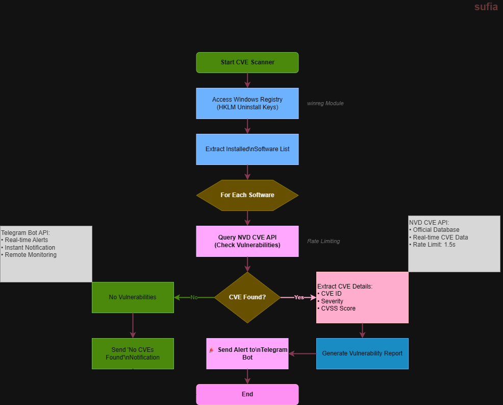

# Installed Software CVE Checker with Telegram Alert

## System Workflow / Architecture

## Problem Statement

Organizations often install multiple software applications on their systems, but many of these applications may contain **known vulnerabilities (CVEs)**.  
Manually checking installed software against vulnerability databases is time-consuming and inefficient.

This tool automates the process by:

- Detecting installed software from Windows Registry
- Checking each software against the **NVD (National Vulnerability Database) CVE API**
- Extracting vulnerability details
- Sending alerts to **Telegram Bot in real-time**

This helps security teams quickly identify vulnerable software and take action.

 

## Approach / Methodology

### Technologies Used

- Python 3.x
- Windows Registry (`winreg`)
- NVD CVE API
- Requests library
- Telegram Bot API
- Time module (rate limit control)

### Workflow / Pipeline

1. Extract installed software from Windows Registry.
2. Select software for vulnerability scanning.
3. Send API request to **NVD CVE database**.
4. Retrieve vulnerability details:
   - CVE ID
   - Severity
   - CVSS Score
5. Generate vulnerability report.
6. Send report to Telegram bot.
7. Notify if no vulnerabilities are found.

## Output / Results

After executing the program, installed software checked with CVE and alert goes to my python BOT that which soft is vulnerable and it's CVE version.

## Real-World Application

- Detect vulnerable software in enterprise environments
- Automate vulnerability monitoring for SOC teams
- Provide real-time alerts for security risks
- Support vulnerability management processes
- Improve endpoint security monitoring

This tool can be integrated into:

- SOC monitoring pipelines
- SIEM alerting systems
- Endpoint detection tools
- Security automation workflows

## Advantages

- Automatically detects vulnerable installed software
- Integrates with official NVD CVE database
- Provides real-time Telegram alerts
- Lightweight and easy to deploy
- Reduces manual vulnerability checking
- Can be extended with:
  - Email alerts
  - Daily scheduled scans
  - CVE severity filtering
  - Dashboard integration
 
 
 
