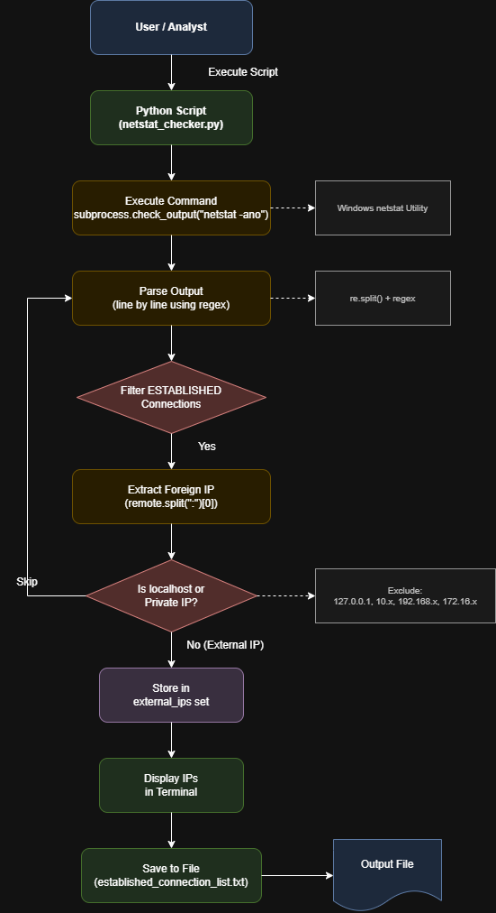

# Netstat Foreign Connection Checker

## System Workflow / Architecture

## Problem Statement

In cybersecurity and SOC operations, it is important to monitor **active network connections** to detect suspicious or unauthorized communication.

Manual inspection using tools like `netstat` can be time-consuming and inefficient.  
This tool automates the process of identifying **established connections with external (foreign) IP addresses**, helping analysts quickly detect potential threats.

## Approach / Methodology

### Technologies Used
- Python 3.x
- `subprocess` to execute system commands
- `re` (regular expressions) for parsing output
- Windows `netstat` utility

### Workflow / Pipeline

1. Execute the `netstat -ano` command to retrieve active network connections.
2. Parse the output line by line.
3. Filter connections with state **ESTABLISHED**.
4. Extract remote (foreign) IP addresses.
5. Exclude:
   - Localhost (`127.0.0.1`)
   - Private IP ranges (`10.x.x.x`, `192.168.x.x`, `172.16.x.x`)
6. Store unique external IPs.
7. Display the IPs in the terminal.
8. Save the results into a file for further analysis.

## Output / Results

Example output:

 

## Real-World Application

- Detect suspicious outbound connections from a system  
- Identify potential malware communicating with external servers  
- Assist SOC analysts in network monitoring tasks  
- Used in incident response to analyze active connections  
- Can be integrated with threat intelligence APIs for further analysis  

 

## Advantages

- Automates manual `netstat` inspection  
- Quickly isolates **external connections only**  
- Lightweight and fast execution  
- Can be extended with:
  - VirusTotal IP checks  
  - Geo-location lookup  
  - Alerting systems (e.g., Telegram, email)  
- Useful for **basic network threat detection and monitoring**
