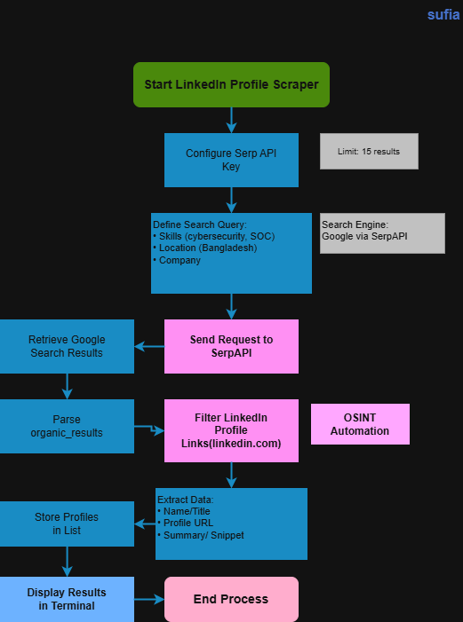

# LinkedIn Profile Scraper

## System Workflow / Architecture

## Problem Statement

Cybersecurity recruiters, SOC teams, and researchers often need to find professionals with specific skills from platforms like LinkedIn.

Manually searching for LinkedIn profiles using Google is time-consuming and inefficient, especially when targeting:

- cybersecurity professionals
- SOC analysts
- information security experts
- specific companies
- specific regions (e.g., Bangladesh)

This tool automates the process of collecting LinkedIn profiles using Google search and SerpAPI, allowing users to quickly gather relevant cybersecurity professional profiles.
 

## Approach / Methodology

### Technologies Used

- Python
- Requests
- SerpAPI
- Google Search Engine

### Workflow / Pipeline

1. Script sends search query to SerpAPI
2. Google search results are retrieved
3. LinkedIn profile links are filtered
4. Profile title and summary are extracted
5. Results are displayed in terminal
 

## Output / Results

.png)
 
## Real-World Application

This tool can be used by:

- cybersecurity recruiters
- SOC team managers
- HR departments
- security researchers
- students looking for professionals in the industry

Use cases:

- finding cybersecurity professionals
- building professional network
- market research
- talent sourcing
- company competitor analysis
- cybersecurity community research

This demonstrates practical **OSINT (Open Source Intelligence) automation**.

## Advantages

- Automated LinkedIn profile discovery
- Fast data collection
- Reduces manual searching
- Useful for OSINT and research
- Easy to customize search query
- Lightweight and simple
- Supports cybersecurity talent sourcing
- Helps build professional network quickly
