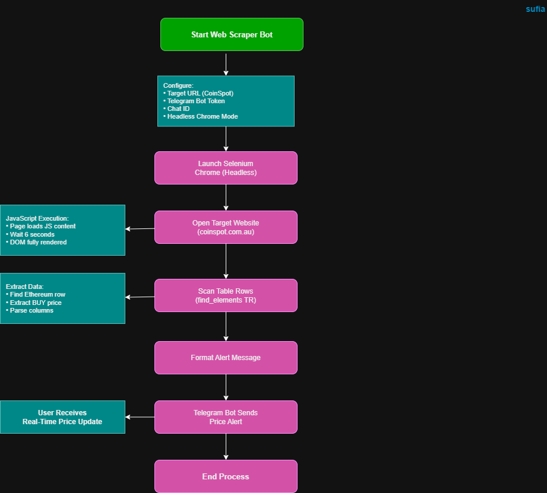

# Website Realtime Data Scraper + Telegram Bot

## System Workflow / Architecture

## Problem Statement

Many websites display real-time data using JavaScript, which makes it difficult to extract information using simple HTTP requests.

Users, traders, and automation engineers often need real-time website data (such as cryptocurrency prices, stock prices, or monitoring data) delivered instantly without manually visiting the website.

Manual monitoring is inefficient and unreliable for real-time decision-making.

This tool solves the problem by automatically reading dynamic website data using Selenium and sending real-time updates to a Telegram bot.
 

## Approach / Methodology

### Technologies Used

- Python
- Selenium
- Chrome WebDriver (Selenium Manager)
- Requests
- Telegram Bot API
- Web Automation

 

### Workflow / Pipeline

1. Python script launches Selenium browser in headless mode
2. Script opens the target website
3. Website content loads using JavaScript
4. Script scans table rows
5. Ethereum price is extracted
6. Data is formatted into a message
7. Telegram bot sends the alert
8. User receives real-time price update

## Output / Results

## Real-World Application

This tool can be used in real-world environments such as:

- Cryptocurrency price monitoring
- Stock market tracking
- Website monitoring automation
- Trading alert systems
- SOC monitoring dashboards
- Business intelligence data scraping
- Real-time alerting systems
- Threat intelligence website monitoring
- Competitive price monitoring

Security analysts and automation engineers can use this tool to monitor websites and receive alerts when specific data changes.
 

## Advantages

- Works with JavaScript-heavy websites
- Real-time data extraction
- Automated Telegram alerts
- Headless browser automation
- Easy to modify for other websites
- Lightweight monitoring solution
- Useful for automation and cybersecurity learning
- Can be scheduled using Task Scheduler or Cron
