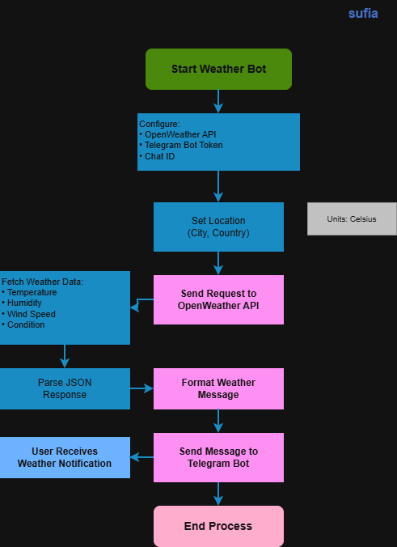

# Weather Data Scraper + Telegram Bot

## System Workflow / Architecture

## Problem Statement

Many users and administrators need real-time weather updates for monitoring environmental conditions, planning operations, or automation workflows.

Manually checking weather websites repeatedly is inefficient and time-consuming. There is a need for an automated system that can fetch real-time weather data and send instant notifications.

This tool solves the problem by automatically collecting weather data and sending updates directly to Telegram.

 
## Approach / Methodology

### Technologies Used

- Python
- Requests
- OpenWeather API
- Telegram Bot API
- Datetime

### Workflow / Pipeline

1. Python script sends request to OpenWeather API
2. Weather data is fetched for a specific city
3. Script extracts temperature, humidity, wind, and condition
4. Message is formatted
5. Telegram Bot sends the weather update
6. User receives real-time weather notification

## Output / Results

## Real-World Application

This tool can be used in real-world environments such as:

- Automated weather notification systems
- Environmental monitoring
- Smart home automation
- Agriculture monitoring
- IoT alert systems
- Daily weather alerts
- Telegram-based automation
- Monitoring conditions for outdoor operations

SOC teams or system administrators can integrate this with monitoring tools to receive alerts based on environmental conditions.

---

## Advantages

- Lightweight and fast
- Real-time weather monitoring
- Easy Telegram integration
- Beginner-friendly
- Easy to automate with Task Scheduler or Cron
- API-based reliable data
- Can be extended for multiple cities
- Useful for automation learning
