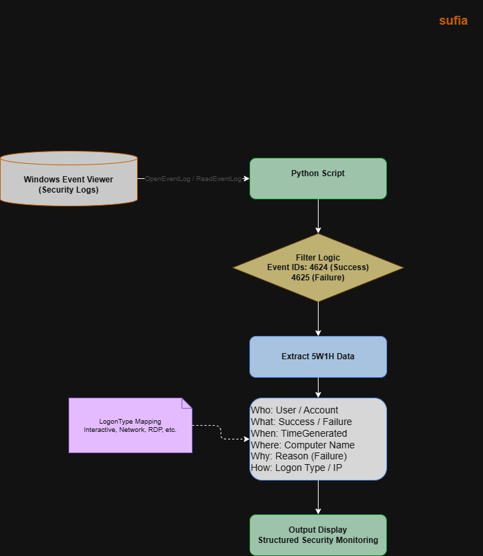

# Windows Event Viewer Log Access (Python)

## System Workflow / Architecture

## Problem Statement

Windows Event Viewer contains critical security logs such as login attempts, failed logins, and system access activities.

Security analysts and system administrators need to monitor these logs to detect suspicious login attempts, brute force attacks, and unauthorized access.

Manually checking Event Viewer is time-consuming and inefficient, especially in large environments where logs are generated continuously.

This tool solves the problem by automatically accessing Windows Security Event Logs using Python and extracting important login events in a structured and readable format.

 

## Approach / Methodology

### Technologies Used

- Python
- PyWin32 (win32evtlog, win32evtlogutil)
- Windows Event Viewer
- Datetime
- Security Log Analysis

 
### Workflow / Pipeline

1. Python script connects to Windows Event Viewer
2. Security log is accessed
3. Logon events (4624 and 4625) are filtered
4. Event details are extracted
5. Data is organized into 5W1H format
6. Login success and failure events are identified
7. Source IP and logon type are extracted
8. Output is displayed for analyst monitoring

 

## Output / Results

%20viewer%20logs%20using%20python.png) 
 

## Real-World Application

This tool can be used in real-world environments such as:

- SOC monitoring systems
- Windows security log analysis
- Login activity monitoring
- Brute force detection
- Incident response investigation
- Threat hunting
- Endpoint monitoring
- Security auditing
- Access monitoring

SOC analysts and cybersecurity professionals can use this tool to monitor login activities, detect suspicious access attempts, and investigate unauthorized logins.
 

## Advantages

- Automated event log access
- Detects login success and failure events
- Structured 5W1H output
- Easy to understand log format
- Useful for SOC monitoring
- Lightweight and fast
- Beginner-friendly cybersecurity project
- Can be integrated with SIEM or alerting systems
- Helps in incident investigation
