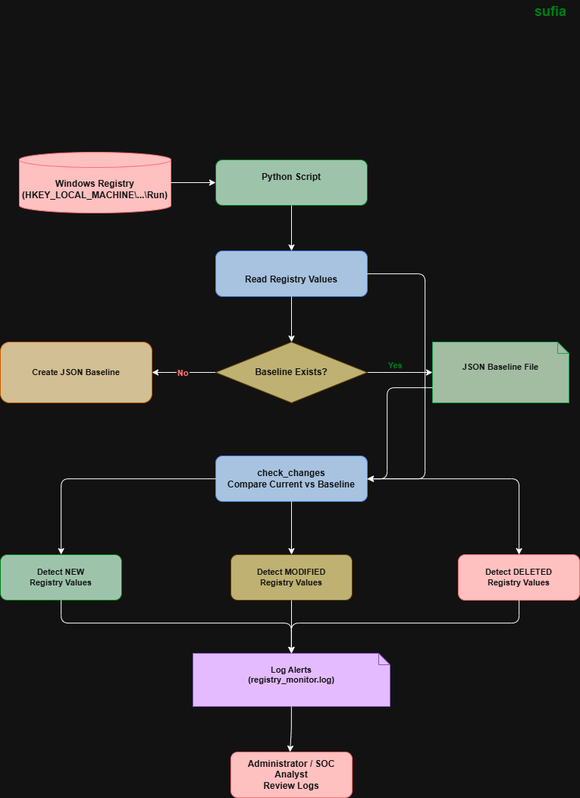

# Windows Registry Value Check

## System Workflow / Architecture

Windows Registry → Python Script → Read Registry Values → Compare with Baseline → Detect Changes → Log Alerts → Administrator Review

 

## Problem Statement

Windows Registry is a critical component of the operating system where startup programs and system configurations are stored.

Attackers and malware often modify registry values (especially in Run and Startup locations) to maintain persistence and execute malicious programs automatically when the system starts.

Manual monitoring of registry values is difficult and time-consuming for administrators and cybersecurity analysts.

This tool solves the problem by automatically checking registry values, comparing them with a baseline, and logging any new, modified, or deleted entries for security monitoring.

 

## Approach / Methodology

### Technologies Used

- Python
- Winreg (Windows Registry Access)
- JSON
- Logging
- OS Module

 

### Workflow / Pipeline

1. Script reads registry values from Windows Run key
2. If baseline does not exist, it creates a registry baseline
3. Current registry values are collected
4. Script compares current values with baseline
5. New registry values are detected
6. Modified registry values are detected
7. Deleted registry values are detected
8. All changes are logged in a log file
9. Administrator reviews the logs

 

## Output / Results

![Output](../outputs/14.%20Windows%20Registry%20value%20check.png 

## Real-World Application

This tool can be used in real-world environments such as:

- SOC monitoring systems
- Windows endpoint monitoring
- Malware persistence detection
- Registry integrity monitoring
- Incident response investigation
- Threat hunting
- System administration security checks
- Endpoint security auditing

SOC analysts and system administrators can use this tool to detect unauthorized registry modifications and identify potential malware persistence techniques.

## Advantages

- Lightweight registry monitoring
- Detects new, modified, and deleted registry values
- Baseline-based integrity checking
- Useful for malware persistence detection
- Easy to integrate with automation
- Supports logging for investigation
- Beginner-friendly cybersecurity monitoring tool
- Can be scheduled with Task Scheduler
