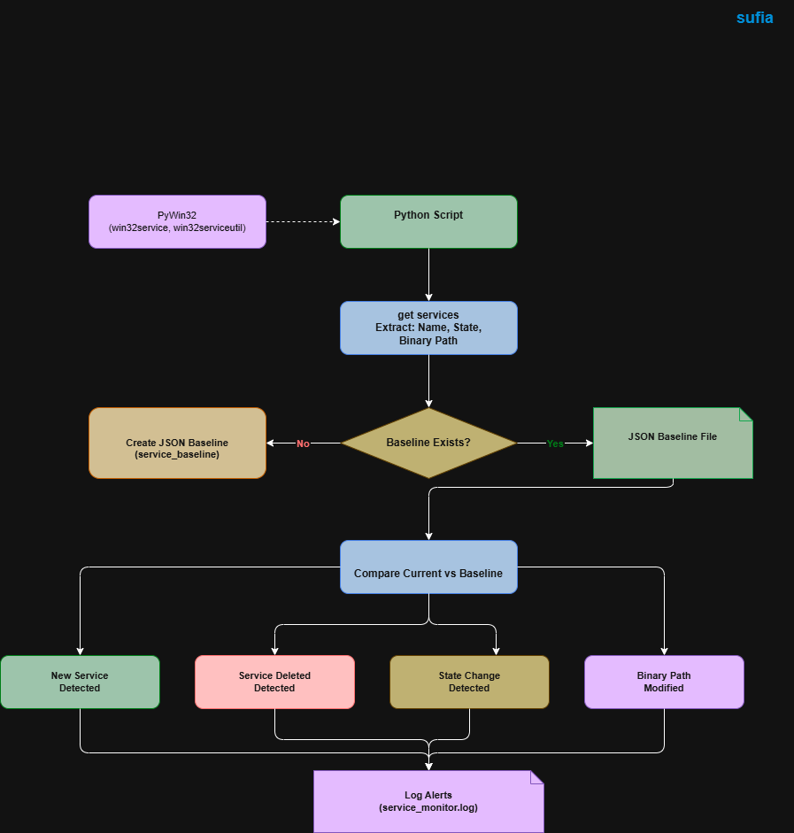

# Windows Service Access Monitor

## System Workflow / Architecture

## Problem Statement

Windows Services run critical system processes and background applications.  
Attackers and malware often create or modify services to maintain persistence, execute malicious binaries, or gain unauthorized system access.

Monitoring Windows services manually is difficult because a system may contain hundreds of services, and changes can occur silently in the background.

This tool solves the problem by automatically enumerating Windows services, creating a baseline, and detecting newly created, deleted, or modified services for security monitoring and investigation.

 

## Approach / Methodology

### Technologies Used

- Python
- PyWin32 (win32service, win32serviceutil)
- JSON
- Logging
- OS Module

 

### Workflow / Pipeline

1. Python script connects to Windows Service Control Manager (SCM)
2. Script collects all available services
3. Service details (name, state, binary path) are extracted
4. Baseline file is created if it does not exist
5. Current services are compared with baseline
6. New services are detected
7. Deleted services are detected
8. Service state changes are detected
9. Service binary modifications are detected
10. All changes are logged for security analysis

 

## Output / Results

 

## Real-World Application

This tool can be used in real-world environments such as:

- SOC monitoring systems
- Windows endpoint monitoring
- Malware persistence detection
- Service integrity monitoring
- Incident response investigation
- Threat hunting
- Endpoint security auditing
- System administration monitoring

SOC analysts and system administrators can use this tool to detect unauthorized service creation, service binary modifications, and suspicious service behavior in Windows systems.

 

## Advantages

- Lightweight service monitoring tool
- Detects new and deleted services
- Detects service state changes
- Detects binary path modifications
- Baseline-based integrity monitoring
- Useful for malware persistence detection
- Easy to integrate with automation
- Logging support for investigation
- Can be scheduled using Task Scheduler
- Beginner-friendly cybersecurity monitoring project
